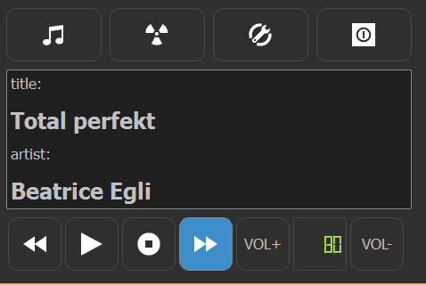
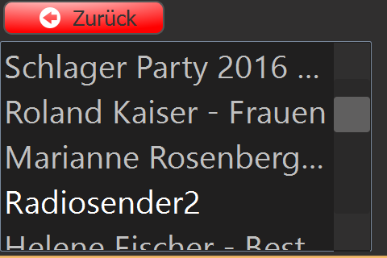

# CuteMpd
MPD Client for small screens written in python
CuteMpd is more or less a UI for the mpc command line tool.
The software has been made for this raspberry pi based device:
http://www.thingiverse.com/thing:1612666




Select a playlist (artist, album or radio station)



A word to german users:
Ja, mit der Software kann man nur Schlager abspielen. ;-)


## Dependencies:
* Python 3.4
  * Qt4
* MPD (Music Player Daemon server)
* MPC (Music Player Client)

## Install MPD on Raspberry Pi
```sh
$> sudo apt-get update
$> sudo apt-get install mpd mpc alsa-utils
```

## Install python3 and Qt4
```sh
$> sudo apt-get install python3-pyqt4
```

### Install python-mpd2 package:
```sh
$> sudo pip3 install python-mpd2
```
### Get the CuteMpd source code from git:
```sh
$> cd ~
$> git clone https://github.com/huvermann/CuteMpd.git
```

## Start CuteMpd
```sh
$> python3 ~/CuteMpd/CuteMpd/CuteMpd.py

```


